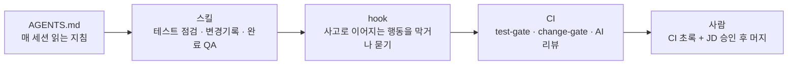
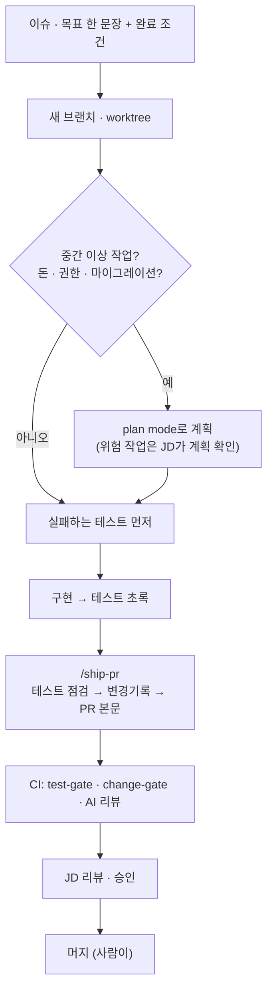

# 에이전트 코딩 팀 가이드

Gardenstep 레포(`gardenstep`·`gardenstep_admin`·`gardenstep-server`·`gardenstep-ai`)에서 코딩 에이전트와 함께 일하는 규칙.
결정의 이유는 [ADR](adr/README.md)에 있다.

## 1. 한눈에



| 층 | 어디에 | 강도 |
|---|---|---|
| AGENTS.md | 각 레포 루트 | 권고 — 에이전트가 읽는다 |
| 스킬 | 이 저장소 `skills/` | 필요할 때 호출 |
| hook | 이 저장소 `hooks/` (플러그인) | 매번 실행 — 편집 차단, Bash 확인 |
| CI | 각 레포 `.github/workflows/` | 빨간 X (무료 플랜이라 머지를 막지는 못함) |
| 사람 | PR 리뷰 | **최종 방어선** |

## 2. 설치

### Claude Code (팀 기본)

레포에 `.claude/settings.json`이 들어간 뒤에는 레포를 열고 **폴더 신뢰(trust)를 수락하면 자동으로 설치**된다.
그 전이나 개인 설정으로 쓰려면:

```text
/plugin marketplace add sramchorok-dev/skills
/plugin install gardenstep-team@sramchorok
```

- Claude Code **v2.1.281 이상**이 필요하다 (`claude --version`). AGENTS.md 자동 로드 조건이다.
- 자동 업데이트는 기본으로 꺼져 있다. `/plugin` → Marketplaces → `sramchorok` → auto-update를 켠다.
- 세션을 열었을 때 `[gardenstep-team v0.x.x]`로 시작하는 안내가 보이면 설치된 것이다.

### Codex · OpenCode

```bash
git clone https://github.com/sramchorok-dev/skills.git && cd skills
python3 scripts/install.py
```

스킬만 설치된다(hook은 Claude Code 전용). Claude Code에서 플러그인과 `install.py`를 둘 다 쓰면 같은 스킬이 두 번 보이니 하나만 쓴다.

## 3. 작업 흐름



1. **목표와 완료 조건부터.** 에이전트에게 "무엇이 되면 끝인가"를 한 문장으로 준다.
2. **작업마다 새 브랜치와 새 세션.** 관련 없는 작업 사이엔 `/clear`. 같은 수정이 두 번 실패하면 초기화하고 요청을 다시 쓴다.
3. **테스트 먼저.** 동작을 바꾸면 실패하는 테스트를 먼저 쓰고 빨간불을 확인한다. 구현할 때 에이전트에게 "테스트는 고치지 말 것"을 조건으로 준다.
4. **PR은 `/ship-pr`로.** 테스트·생성물을 뺀 변경이 400줄을 넘으면 나눈다.
5. **설명 책임.** 리뷰 질문에 "AI가 그렇게 했다"는 답이 되지 않는다. 작성자가 모든 변경을 설명할 수 있어야 한다.

## 4. hook이 하는 일

| 상황 | 동작 | 이유 |
|---|---|---|
| `.env`·키 파일·`application-prod*`·`.claude/settings*.json` 편집 | **차단** | 비밀값·권한 설정은 사람이 다룬다 |
| 이미 dev에 있는 Liquibase changeset 편집 | **차단** → 새 changeset을 만들라고 안내 | checksum이 바뀌면 배포가 멈춘다 |
| `main`·`release/*` push, force push, 원격 브랜치 삭제 | **확인** | 운영 배포로 이어진다 |
| `gh pr merge`, `gh workflow run`, `gh run rerun` | **확인** | 머지·배포·롤백은 사람이 판단한다 |
| `mysql … UPDATE/DELETE/DDL`, SQL 파일 실행, Liquibase 직접 실행 | **확인** | 운영 DB는 조회만, 쓰기는 JD가 SQL을 승인한 경우만 |
| `ssh`, AWS 변경, `rm -rf`, `git reset --hard`, `--no-verify`, `sudo` 등 | **확인** | 되돌리기 어렵다 |
| `gh pr create` 때 변경기록·`## 검증`·테스트 점검 미비 | **확인** + 빠진 항목 목록 | PR 전에 채우는 것이 싸다 |
| 테스트 파일에 `.only`·`skip`·`@Disabled`·고정 대기 추가 | 알림 | test-audit에서 FAIL이 될 항목 |
| 코드가 바뀌었는데 테스트 변경이 없음 | 브랜치당 한 번 되돌려 보냄 | 테스트 규칙 v1 |

- **확인(ask)** 은 프롬프트에 사유가 뜬다. 사유를 읽고 맞으면 승인, 아니면 거절한다. 습관적으로 승인하지 않는다.
- hook은 Claude를 거치는 작업만 본다. 터미널에서 직접 하는 작업은 CI와 팀 규칙이 지킨다.

## 5. 테스트 규칙

정본: [testing-policy.md](../skills/gardenstep-test-audit/references/testing-policy.md). 한 줄 요약: **바뀐 사용자 동작 하나에 E2E 하나, 계산이 바뀌면 순수 로직 테스트 하나.**

- PR 본문 `## 검증`에 확인한 동작·환경·결과와 **결함 감지** 한 줄(구현을 일부러 망가뜨렸을 때 어떤 테스트가 떨어졌나)을 쓴다.
- 점검: `gardenstep-test-audit` 스킬. 실행 증거: `gardenstep-completion-qa` 스킬.
- 면제는 `test-exempt` 라벨 + 사유 + JD 승인.

## 6. 변경기록

PR마다 `docs/changes/YYYY/YYYY-MM-DD-<브랜치>.md` 하나. `/ship-pr`이 초안을 만든다.

```markdown
---
date: 2026-10-06
branch: feat/cart-coupon
pr: 1130
type: feat          # feat | fix | refactor | perf | migration | chore | docs | test | ci
risk: money         # normal | money | migration | security | infra
rollback: image     # image | rds-snapshot | config | revert | n/a
tests: [cart.spec.ts, CouponServiceTest]
adr: none
---

# 장바구니에서 쿠폰을 적용한다

## 무엇이 바뀌었나
- 장바구니에 쿠폰 입력칸이 생기고 할인 금액이 합계에 반영된다

## 왜
- 추석 프로모션 요청 (이슈 #120)

## 확인한 것
- cart.spec.ts: 쿠폰 적용·만료 쿠폰 거절 통과 (로컬 Chromium)
```

- **`## 왜`는 사람이 준 이유만.** 에이전트가 이유를 모르면 묻는다. 지어낸 이유는 기록 전체의 신뢰를 무너뜨린다.
- Liquibase 파일을 바꾸면 `rollback: rds-snapshot` (이미지 롤백 불가).
- 검사: `python3 skills/gardenstep-change-log/scripts/change_record.py check --repo .` (CI `change-gate`와 같다).

## 7. ADR

기본값은 **쓰지 않는다.** 아래 셋 중 둘 이상일 때만 쓴다.

1. 되돌리기 비싸다 (스키마·데이터·외부 계약·인프라·배포 방식)
2. 레포 2개 이상 또는 팀 작업 방식 전체에 영향
3. 대안을 진지하게 검토했고, 반년 뒤 "왜?"라는 질문이 예상된다

레포 결정은 그 레포 `docs/decisions/`, 팀 결정은 이 저장소 [`docs/adr/`](adr/README.md). 한 페이지를 넘기지 않는다.

## 8. AI 코드 리뷰 (시범)

Ready 상태 PR에 Claude가 결함 리뷰와 "바뀐 동작 ↔ 테스트" 매핑표를 단다. AI 리뷰는 **머지를 막지 않고 사람 리뷰를 대신하지 않는다.**
시범 결과로 도구를 확정한다 → [ADR 0004](adr/0004-ai-code-review.md).

## 9. 머지 조건

1. CI 초록 (test-gate · change-gate · 빌드·테스트)
2. PR 본문 `## 검증`과 변경기록
3. JD 승인 1명
4. 머지는 사람이 한다. 빨간 X 상태로 머지한 PR은 dev에서 revert한다.

## 10. 자주 묻는 것

**hook이 확인을 너무 자주 묻는다.** 어떤 명령이 왜 걸렸는지와 함께 이 저장소에 이슈를 남긴다. 규칙은 실제 불편이 확인될 때 조정한다.

**꼭 해야 하는 작업인데 편집이 차단됐다.** 차단된 파일(비밀값·운영 설정·적용된 changeset)은 사람이 직접 다루거나 JD에게 요청한다. hook을 끄지 않는다.

**규칙을 바꾸고 싶다.** 이 저장소에 PR을 연다. hook·스킬을 바꾸면 `.claude-plugin/plugin.json`의 `version`을 올린다(올리지 않으면 팀원 캐시가 갱신되지 않는다). 결정이 ADR 기준에 맞으면 ADR을 추가한다.

**AGENTS.md를 에이전트가 안 읽는 것 같다.** 세션 시작 안내에 경고가 있는지 본다. 작업 디렉터리 상위에 CLAUDE.md가 있으면 `/config` → Project instructions를 `claude-md-and-agents-md`로 바꾼다.
